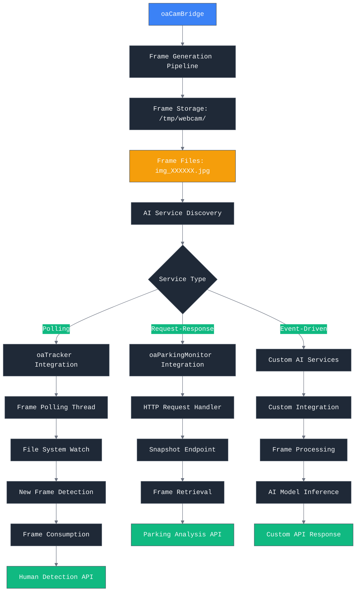
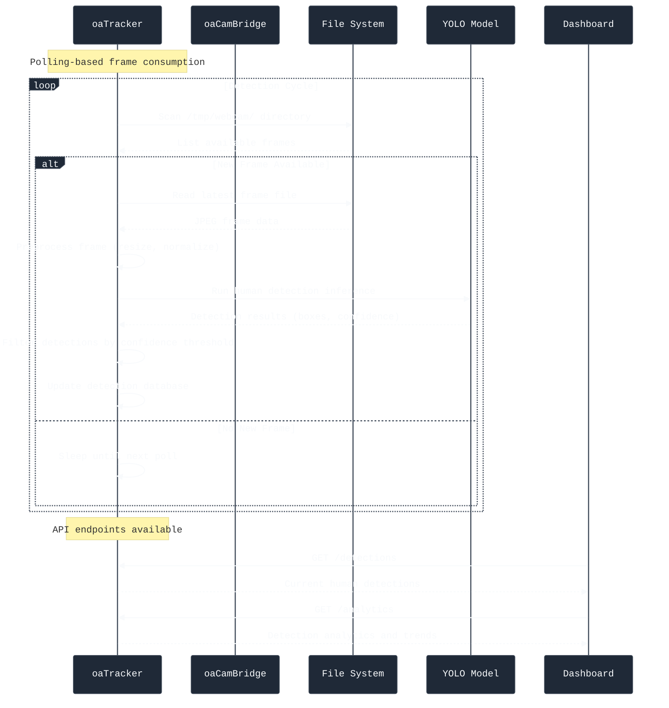
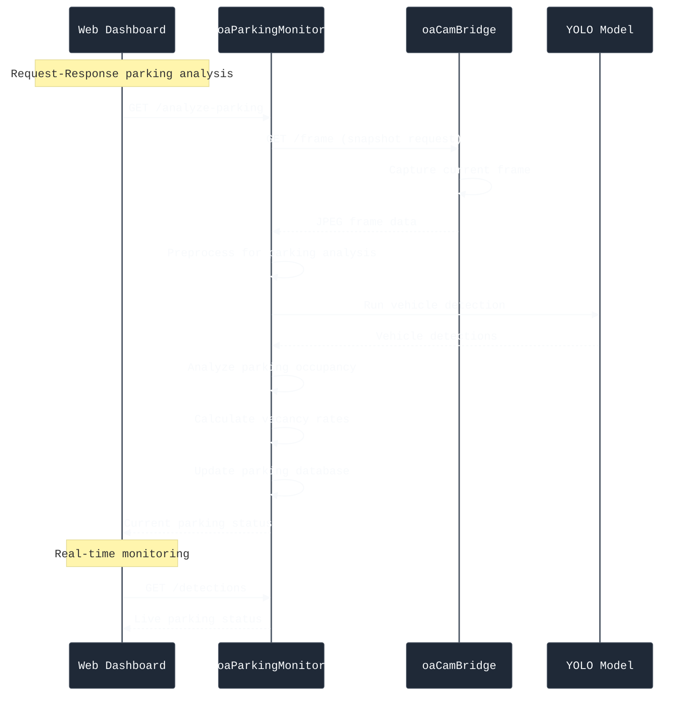
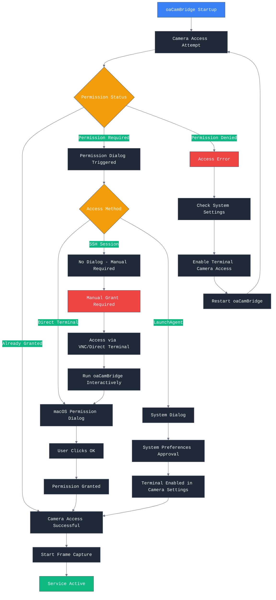
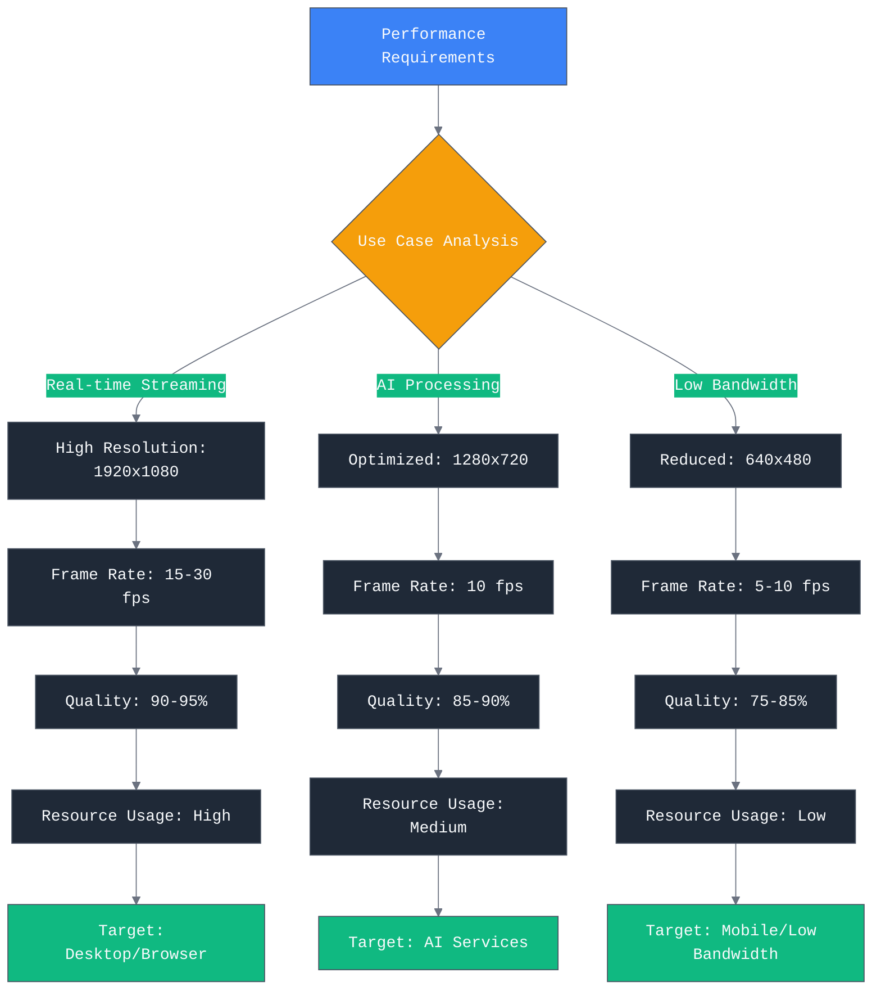
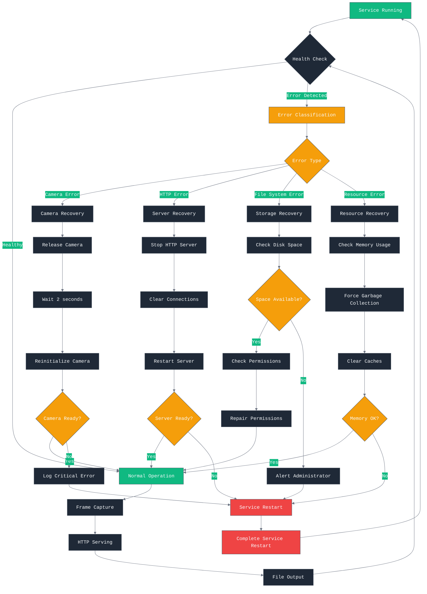

# oaCamBridge Integration Guide

Comprehensive integration patterns and procedures for connecting oaCamBridge with AI services, macOS camera permissions, and performance optimization.

## Overview

**oaCamBridge** serves as the camera access layer for AI processing pipelines, providing:
- Real-time camera frame capture (OpenCV-based)
- HTTP/MJPEG streaming for monitoring (port 8086)
- Sequential frame output for AI service consumption
- macOS camera permission handling and optimization

## AI Service Integration Patterns

### Frame Consumption Architecture



### oaTracker Integration (Polling Pattern)

#### Integration Architecture



#### Implementation Example

```python
# oaTracker frame consumption implementation
import os
import time
import cv2
import numpy as np
from pathlib import Path

class FrameConsumer:
    def __init__(self, frame_dir="/tmp/webcam/"):
        self.frame_dir = Path(frame_dir)
        self.last_frame = None
        self.poll_interval = 0.1  # 100ms

    def poll_for_frames(self):
        """Continuously poll for new frames"""
        while True:
            latest_frame = self.get_latest_frame()

            if latest_frame and latest_frame != self.last_frame:
                # Process new frame
                self.process_frame(latest_frame)
                self.last_frame = latest_frame

            time.sleep(self.poll_interval)

    def get_latest_frame(self):
        """Get the most recent frame file"""
        frame_files = sorted(self.frame_dir.glob("img_*.jpg"))
        return frame_files[-1] if frame_files else None

    def process_frame(self, frame_path):
        """Process frame through AI model"""
        try:
            # Read JPEG frame
            frame = cv2.imread(str(frame_path))

            # Preprocess for model
            processed = self.preprocess_frame(frame)

            # Run inference
            detections = self.model.predict(processed)

            # Process results
            self.handle_detections(detections, frame_path)

        except Exception as e:
            print(f"Frame processing error: {e}")
```

### oaParkingMonitor Integration (Request-Response Pattern)

#### Integration Architecture



#### Implementation Example

```python
# oaParkingMonitor frame consumption implementation
import requests
import cv2
import numpy as np

class ParkingAnalyzer:
    def __init__(self, cambridge_url="http://localhost:8086"):
        self.cambridge_url = cambridge_url
        self.parking_zones = self.load_parking_zones()

    def analyze_parking_snapshot(self):
        """Request and analyze current parking snapshot"""
        try:
            # Get frame from oaCamBridge
            frame = self.get_current_frame()
            if frame is None:
                return {"error": "No frame available"}

            # Run parking analysis
            results = self.analyze_parking(frame)

            # Update database
            self.update_parking_database(results)

            return results

        except Exception as e:
            return {"error": str(e)}

    def get_current_frame(self):
        """Get current frame from oaCamBridge"""
        try:
            response = requests.get(f"{self.cambridge_url}/frame", timeout=5)
            if response.status_code == 200:
                # Convert JPEG to numpy array
                frame_array = np.frombuffer(response.content, dtype=np.uint8)
                frame = cv2.imdecode(frame_array, cv2.IMREAD_COLOR)
                return frame
        except Exception as e:
            print(f"Frame request error: {e}")
        return None

    def analyze_parking(self, frame):
        """Analyze parking occupancy in frame"""
        # Preprocess frame
        processed = self.preprocess_parking_frame(frame)

        # Run vehicle detection
        detections = self.parking_model.predict(processed)

        # Analyze parking zones
        occupancy = {}
        for zone_id, zone_coords in self.parking_zones.items():
            occupied = self.check_zone_occupancy(detections, zone_coords)
            occupancy[zone_id] = {
                "occupied": occupied,
                "confidence": self.calculate_confidence(detections, zone_coords)
            }

        return {
            "timestamp": time.time(),
            "total_spots": len(self.parking_zones),
            "occupied_spots": sum(1 for o in occupancy.values() if o["occupied"]),
            "occupancy_rate": sum(1 for o in occupancy.values() if o["occupied"]) / len(self.parking_zones),
            "zones": occupancy
        }
```

## macOS Camera Permissions Management

### Permission Acquisition Workflow



### Permission Troubleshooting Guide

#### Common Permission Issues

**Issue 1: SSH Session No Permission Dialog**
```bash
# Symptom: Camera access denied when running via SSH
# Solution: Access via VNC or direct terminal first

# Step 1: Connect via VNC or direct console access
# Step 2: Run oaCamBridge interactively
python3 camera_streamer.py --config config.json

# Step 3: Click "OK" when permission dialog appears
# Step 4: Permission granted for Terminal application
```

**Issue 2: Terminal Not in Camera Settings**
```bash
# Symptom: Terminal app not listed in System Settings → Privacy & Security → Camera
# Solution: Reset and re-grant permissions

# Reset camera permissions
sudo tccutil reset Camera

# Restart Terminal app
osascript -e 'tell application "Terminal" to quit'
open -a Terminal

# Run oaCamBridge again to trigger permission dialog
python3 camera_streamer.py --config config.json
```

**Issue 3: LaunchAgent Permission Issues**
```bash
# Symptom: LaunchAgent service can't access camera
# Solution: Grant permissions via System Settings

# Step 1: Enable Terminal camera permissions first
# (run interactively once to grant permissions)

# Step 2: Grant Terminal Full Disk Access (for LaunchAgent)
# System Settings → Privacy & Security → Full Disk Access → Add Terminal

# Step 3: Load LaunchAgent
launchctl load ~/Library/LaunchAgents/com.orangead.cambridge.plist
```

#### Automated Permission Check Script

```bash
#!/bin/bash
# check_camera_permissions.sh - Check and guide camera permission setup

echo "=== macOS Camera Permission Check ==="

# Check if running via SSH
if [ -n "$SSH_TTY" ]; then
    echo "⚠️  Running via SSH - permission dialog won't appear"
    echo "   Please run this script via VNC or direct console access"
    echo ""
fi

# Test camera access
echo "Testing camera access..."
python3 -c "
import cv2
try:
    cap = cv2.VideoCapture(0)
    if cap.isOpened():
        print('✅ Camera access successful')
        cap.release()
    else:
        print('❌ Camera access denied')
        print('   Check System Settings → Privacy & Security → Camera')
        print('   Ensure Terminal has camera permissions')
except Exception as e:
    print(f'❌ Camera error: {e}')
"

# Check system permissions
echo ""
echo "=== System Settings Check ==="
echo "1. Open System Settings → Privacy & Security → Camera"
echo "2. Ensure Terminal is enabled"
echo "3. If Terminal not listed, run oaCamBridge interactively once"

# Provide next steps
echo ""
echo "=== Next Steps ==="
echo "1. If permissions denied: reset with 'sudo tccutil reset Camera'"
echo "2. Restart Terminal app"
echo "3. Run oaCamBridge interactively to grant permissions"
echo "4. Start service via LaunchAgent for automated operation"
```

## Performance Optimization

### Camera Performance Tuning

#### Resolution and Frame Rate Optimization



#### Configuration Optimization

**AI Processing Configuration**:
```json
{
  "camera_index": "0",
  "width": 1280,
  "height": 720,
  "fps": 10,
  "frame_fps": 5,
  "frame_dir": "/tmp/webcam",
  "quality": 90,
  "http_port": 8086,
  "buffer_size": 3,
  "thread_pool_size": 4
}
```

**Streaming Configuration**:
```json
{
  "camera_index": "0",
  "width": 1920,
  "height": 1080,
  "fps": 30,
  "frame_fps": 15,
  "frame_dir": "/tmp/webcam",
  "quality": 95,
  "http_port": 8086,
  "buffer_size": 10,
  "thread_pool_size": 8
}
```

#### Memory Management Optimization

```python
# Memory-efficient frame processing
class OptimizedCameraStreamer:
    def __init__(self, config):
        self.config = config
        self.frame_buffer = collections.deque(maxlen=config.get('buffer_size', 3))
        self.frame_lock = threading.Lock()

    def process_frame_efficiently(self, frame):
        """Process frame with minimal memory overhead"""
        try:
            # Resize in-place if needed
            if frame.shape[:2] != (self.config['height'], self.config['width']):
                frame = cv2.resize(frame,
                                 (self.config['width'], self.config['height']),
                                 interpolation=cv2.INTER_AREA)

            # Convert to JPEG with quality control
            encode_param = [int(cv2.IMWRITE_JPEG_QUALITY), self.config['quality']]
            result, encoded = cv2.imencode('.jpg', frame, encode_param)

            if result:
                return encoded.tobytes()
            else:
                return None

        except Exception as e:
            print(f"Frame processing error: {e}")
            return None

    def manage_memory(self):
        """Monitor and manage memory usage"""
        process = psutil.Process()
        memory_mb = process.memory_info().rss / 1024 / 1024

        if memory_mb > 100:  # Alert if > 100MB
            print(f"High memory usage: {memory_mb:.1f}MB")

            # Force garbage collection
            import gc
            gc.collect()
```

### Network Performance Optimization

#### HTTP Server Tuning

```python
# Optimized HTTP server for high-performance streaming
class OptimizedHTTPServer(ThreadingMixIn, HTTPServer):
    """Threaded HTTP server with performance optimizations"""

    daemon_threads = True
    timeout = 30

    def __init__(self, server_address, RequestHandlerClass):
        super().__init__(server_address, RequestHandlerClass)

        # Configure socket options
        self.socket.setsockopt(socket.SOL_SOCKET, socket.SO_REUSEADDR, 1)
        self.socket.setsockopt(socket.IPPROTO_TCP, socket.TCP_NODELAY, 1)

        # Configure thread pool
        self.thread_pool_size = 8
        self.active_connections = 0
        self.max_connections = 50

class StreamingRequestHandler(BaseHTTPRequestHandler):
    """Optimized request handler for streaming"""

    def __init__(self, *args, camera_streamer, **kwargs):
        self.camera_streamer = camera_streamer
        super().__init__(*args, **kwargs)

    def do_GET(self):
        """Handle GET requests with optimized routing"""
        if self.path == '/stream':
            self.handle_streaming()
        elif self.path == '/frame':
            self.handle_single_frame()
        elif self.path == '/status':
            self.handle_status()
        else:
            self.send_error(404)

    def handle_streaming(self):
        """Optimized MJPEG streaming"""
        self.send_response(200)
        self.send_header('Content-type', 'multipart/x-mixed-replace; boundary=--jpgboundary')
        self.send_header('Cache-Control', 'no-cache, no-store, must-revalidate')
        self.send_header('Connection', 'close')
        self.end_headers()

        try:
            while True:
                # Get latest frame
                frame_data = self.camera_streamer.get_latest_frame()
                if frame_data:
                    # Send frame boundary
                    self.wfile.write(b'--jpgboundary\r\n')
                    self.wfile.write(b'Content-Type: image/jpeg\r\n')
                    self.wfile.write(f'Content-Length: {len(frame_data)}\r\n\r\n'.encode())
                    self.wfile.write(frame_data)
                    self.wfile.write(b'\r\n')
                    self.wfile.flush()

                # Small delay to prevent overwhelming
                time.sleep(0.033)  # ~30 fps

        except (ConnectionResetError, BrokenPipeError):
            # Client disconnected
            pass
```

#### Caching and Performance Monitoring

```python
# Performance monitoring and caching
class PerformanceMonitor:
    def __init__(self):
        self.metrics = {
            'frames_processed': 0,
            'frames_dropped': 0,
            'avg_processing_time': 0,
            'memory_usage': 0,
            'cpu_usage': 0
        }
        self.start_time = time.time()

    def record_frame_processing(self, processing_time):
        """Record frame processing performance"""
        self.metrics['frames_processed'] += 1

        # Update average processing time
        total_time = self.metrics['avg_processing_time'] * (self.metrics['frames_processed'] - 1)
        self.metrics['avg_processing_time'] = (total_time + processing_time) / self.metrics['frames_processed']

    def record_dropped_frame(self):
        """Record dropped frame"""
        self.metrics['frames_dropped'] += 1

    def get_performance_stats(self):
        """Get current performance statistics"""
        runtime = time.time() - self.start_time
        fps = self.metrics['frames_processed'] / runtime if runtime > 0 else 0

        return {
            'runtime_seconds': runtime,
            'frames_per_second': fps,
            'frames_processed': self.metrics['frames_processed'],
            'frames_dropped': self.metrics['frames_dropped'],
            'drop_rate': self.metrics['frames_dropped'] / max(1, self.metrics['frames_processed']),
            'avg_processing_time_ms': self.metrics['avg_processing_time'] * 1000,
            'memory_usage_mb': self.metrics['memory_usage'],
            'cpu_usage_percent': self.metrics['cpu_usage']
        }
```

## Frame Processing Best Practices

### AI Service Frame Consumption Patterns

#### 1. Efficient Frame Reading

```python
# Optimized frame reading for AI services
class EfficientFrameReader:
    def __init__(self, frame_dir="/tmp/webcam/"):
        self.frame_dir = Path(frame_dir)
        self.last_frame_number = 0
        self.frame_cache = {}

    def get_latest_frame(self, use_cache=True):
        """Get latest frame with optional caching"""
        try:
            # Get latest frame file
            frame_files = sorted(self.frame_dir.glob("img_*.jpg"))
            if not frame_files:
                return None

            latest_file = frame_files[-1]
            frame_number = int(latest_file.stem.split('_')[1])

            # Check if we already have this frame cached
            if use_cache and frame_number in self.frame_cache:
                return self.frame_cache[frame_number]

            # Read and cache frame
            frame = cv2.imread(str(latest_file))
            if frame is not None:
                # Limit cache size
                if len(self.frame_cache) > 10:
                    # Remove oldest frame
                    oldest_key = min(self.frame_cache.keys())
                    del self.frame_cache[oldest_key]

                self.frame_cache[frame_number] = frame
                self.last_frame_number = frame_number

            return frame

        except Exception as e:
            print(f"Frame reading error: {e}")
            return None

    def has_new_frame(self):
        """Check if new frame is available"""
        try:
            frame_files = sorted(self.frame_dir.glob("img_*.jpg"))
            if not frame_files:
                return False

            latest_file = frame_files[-1]
            frame_number = int(latest_file.stem.split('_')[1])

            return frame_number > self.last_frame_number

        except:
            return False
```

#### 2. Frame Processing Pipeline

```python
# Frame processing pipeline for AI services
class FrameProcessingPipeline:
    def __init__(self, target_size=(640, 640), normalize=True):
        self.target_size = target_size
        self.normalize = normalize

    def preprocess_frame(self, frame):
        """Preprocess frame for AI model inference"""
        try:
            # Resize frame
            if frame.shape[:2] != self.target_size[::-1]:
                frame = cv2.resize(frame, self.target_size, interpolation=cv2.INTER_AREA)

            # Convert color space if needed (BGR to RGB)
            if len(frame.shape) == 3 and frame.shape[2] == 3:
                frame = cv2.cvtColor(frame, cv2.COLOR_BGR2RGB)

            # Normalize pixel values
            if self.normalize:
                frame = frame.astype(np.float32) / 255.0

            # Add batch dimension if needed
            if len(frame.shape) == 3:
                frame = np.expand_dims(frame, axis=0)

            return frame

        except Exception as e:
            print(f"Frame preprocessing error: {e}")
            return None

    def batch_process_frames(self, frames, batch_size=4):
        """Process multiple frames in batches"""
        processed_frames = []

        for i in range(0, len(frames), batch_size):
            batch = frames[i:i + batch_size]
            batch_processed = []

            for frame in batch:
                processed = self.preprocess_frame(frame)
                if processed is not None:
                    batch_processed.append(processed)

            if batch_processed:
                # Stack batch
                batch_array = np.vstack(batch_processed)
                processed_frames.append(batch_array)

        return processed_frames
```

## Reliability and Error Handling

### Robust Error Recovery



### Graceful Degradation Strategies

```python
# Graceful degradation for camera issues
class ResilientCameraStreamer:
    def __init__(self, config):
        self.config = config
        self.camera = None
        self.fallback_mode = False
        self.error_count = 0
        self.max_errors = 5

    def start_camera_with_fallback(self):
        """Start camera with fallback strategies"""
        camera_attempts = [
            self.config['camera_index'],  # Primary camera
            "0",                          # Default camera
            "1",                          # Secondary camera
        ]

        for attempt in camera_attempts:
            try:
                self.camera = cv2.VideoCapture(attempt)
                if self.camera.isOpened():
                    # Test frame capture
                    ret, frame = self.camera.read()
                    if ret and frame is not None:
                        print(f"Camera successfully opened: {attempt}")
                        self.error_count = 0
                        self.fallback_mode = False
                        return True

            except Exception as e:
                print(f"Camera attempt {attempt} failed: {e}")
                if self.camera:
                    self.camera.release()
                    self.camera = None

        # All attempts failed - enter fallback mode
        self.fallback_mode = True
        return False

    def capture_frame_with_recovery(self):
        """Capture frame with automatic recovery"""
        if self.fallback_mode:
            return self.generate_placeholder_frame()

        try:
            ret, frame = self.camera.read()
            if ret and frame is not None:
                self.error_count = 0
                return frame
            else:
                self.error_count += 1
                if self.error_count >= self.max_errors:
                    print("Multiple frame capture failures, attempting recovery")
                    self.recover_camera()
                return None

        except Exception as e:
            print(f"Frame capture error: {e}")
            self.error_count += 1
            if self.error_count >= self.max_errors:
                self.recover_camera()
            return None

    def recover_camera(self):
        """Attempt to recover camera connection"""
        print("Attempting camera recovery...")

        if self.camera:
            self.camera.release()
            self.camera = None

        # Wait before reconnection attempt
        time.sleep(2)

        if self.start_camera_with_fallback():
            print("Camera recovery successful")
        else:
            print("Camera recovery failed, using fallback mode")
```

## Monitoring and Analytics

### Performance Metrics Collection

```python
# Comprehensive monitoring system
class CamBridgeMonitor:
    def __init__(self):
        self.metrics = {
            'camera': {
                'frames_captured': 0,
                'frames_dropped': 0,
                'capture_errors': 0,
                'avg_capture_time': 0
            },
            'http': {
                'requests_served': 0,
                'active_connections': 0,
                'stream_clients': 0,
                'avg_response_time': 0
            },
            'filesystem': {
                'frames_written': 0,
                'disk_usage_mb': 0,
                'write_errors': 0,
                'write_speed_mbps': 0
            },
            'system': {
                'cpu_usage': 0,
                'memory_usage_mb': 0,
                'uptime_seconds': 0
            }
        }
        self.start_time = time.time()

    def update_camera_metrics(self, capture_time, success=True):
        """Update camera performance metrics"""
        if success:
            self.metrics['camera']['frames_captured'] += 1

            # Update average capture time
            total_frames = self.metrics['camera']['frames_captured']
            if total_frames == 1:
                self.metrics['camera']['avg_capture_time'] = capture_time
            else:
                current_avg = self.metrics['camera']['avg_capture_time']
                self.metrics['camera']['avg_capture_time'] = (
                    (current_avg * (total_frames - 1) + capture_time) / total_frames
                )
        else:
            self.metrics['camera']['capture_errors'] += 1

    def update_http_metrics(self, response_time, client_type='unknown'):
        """Update HTTP server metrics"""
        self.metrics['http']['requests_served'] += 1

        if client_type == 'stream':
            self.metrics['http']['stream_clients'] += 1

        # Update average response time
        total_requests = self.metrics['http']['requests_served']
        if total_requests == 1:
            self.metrics['http']['avg_response_time'] = response_time
        else:
            current_avg = self.metrics['http']['avg_response_time']
            self.metrics['http']['avg_response_time'] = (
                (current_avg * (total_requests - 1) + response_time) / total_requests
            )

    def get_system_metrics(self):
        """Get current system resource usage"""
        try:
            process = psutil.Process()

            # CPU usage
            self.metrics['system']['cpu_usage'] = process.cpu_percent()

            # Memory usage
            memory_info = process.memory_info()
            self.metrics['system']['memory_usage_mb'] = memory_info.rss / 1024 / 1024

            # Uptime
            self.metrics['system']['uptime_seconds'] = time.time() - self.start_time

            # Disk usage for frame directory
            if os.path.exists('/tmp/webcam/'):
                disk_usage = psutil.disk_usage('/tmp/webcam/')
                self.metrics['filesystem']['disk_usage_mb'] = disk_usage.used / 1024 / 1024

        except Exception as e:
            print(f"System metrics error: {e}")

    def generate_performance_report(self):
        """Generate comprehensive performance report"""
        self.get_system_metrics()

        fps = self.metrics['camera']['frames_captured'] / max(1, self.metrics['system']['uptime_seconds'])
        drop_rate = self.metrics['camera']['frames_dropped'] / max(1, self.metrics['camera']['frames_captured'])

        return {
            'performance': {
                'frames_per_second': fps,
                'frame_drop_rate': drop_rate,
                'avg_capture_time_ms': self.metrics['camera']['avg_capture_time'] * 1000,
                'avg_response_time_ms': self.metrics['http']['avg_response_time'] * 1000
            },
            'resources': {
                'cpu_usage_percent': self.metrics['system']['cpu_usage'],
                'memory_usage_mb': self.metrics['system']['memory_usage_mb'],
                'disk_usage_mb': self.metrics['filesystem']['disk_usage_mb']
            },
            'service_stats': {
                'frames_captured': self.metrics['camera']['frames_captured'],
                'requests_served': self.metrics['http']['requests_served'],
                'active_connections': self.metrics['http']['active_connections'],
                'uptime_hours': self.metrics['system']['uptime_seconds'] / 3600
            }
        }
```

## Integration Testing

### End-to-End Test Suite

```python
# Comprehensive integration test suite
import unittest
import requests
import cv2
import time
import tempfile
from pathlib import Path

class CamBridgeIntegrationTest(unittest.TestCase):
    @classmethod
    def setUpClass(cls):
        """Test suite setup"""
        cls.cambridge_url = "http://localhost:8086"
        cls.temp_dir = tempfile.mkdtemp()

    def test_service_health(self):
        """Test basic service health"""
        response = requests.get(f"{self.cambridge_url}/status", timeout=5)
        self.assertEqual(response.status_code, 200)

        data = response.json()
        self.assertIn('running', data)
        self.assertTrue(data['running'])

    def test_frame_capture(self):
        """Test frame capture functionality"""
        response = requests.get(f"{self.cambridge_url}/frame", timeout=10)
        self.assertEqual(response.status_code, 200)

        # Verify JPEG content
        self.assertEqual(response.headers['content-type'], 'image/jpeg')
        self.assertGreater(len(response.content), 1000)  # Reasonable frame size

        # Verify image can be decoded
        frame_array = np.frombuffer(response.content, dtype=np.uint8)
        frame = cv2.imdecode(frame_array, cv2.IMREAD_COLOR)
        self.assertIsNotNone(frame)
        self.assertEqual(len(frame.shape), 3)  # Color image

    def test_streaming_functionality(self):
        """Test MJPEG streaming"""
        response = requests.get(f"{self.cambridge_url}/stream", stream=True, timeout=10)
        self.assertEqual(response.status_code, 200)

        # Verify streaming headers
        self.assertIn('multipart/x-mixed-replace', response.headers['content-type'])

        # Read first frame from stream
        content = b''
        frame_received = False

        for chunk in response.iter_content(chunk_size=1024):
            content += chunk
            if b'Content-Type: image/jpeg' in content and b'\r\n\r\n' in content:
                frame_received = True
                break

        self.assertTrue(frame_received)

    def test_ai_service_integration(self):
        """Test AI service integration patterns"""
        # Test frame file generation
        response = requests.get(f"{self.cambridge_url}/frame", timeout=5)
        frame_data = response.content

        # Save frame to simulate AI service processing
        frame_path = Path(self.temp_dir) / "test_frame.jpg"
        frame_path.write_bytes(frame_data)

        # Verify frame can be read by AI service simulation
        frame = cv2.imread(str(frame_path))
        self.assertIsNotNone(frame)

        # Simulate AI processing
        resized = cv2.resize(frame, (640, 640))
        self.assertEqual(resized.shape[:2], (640, 640))

    def test_performance_benchmarks(self):
        """Test performance benchmarks"""
        # Test frame capture speed
        start_time = time.time()
        response_times = []

        for _ in range(10):
            start = time.time()
            response = requests.get(f"{self.cambridge_url}/frame", timeout=5)
            response_times.append(time.time() - start)

        total_time = time.time() - start_time
        avg_response_time = sum(response_times) / len(response_times)

        # Performance assertions
        self.assertLess(total_time, 5.0)  # 10 frames in < 5 seconds
        self.assertLess(avg_response_time, 1.0)  # Average < 1 second per frame

    def test_error_handling(self):
        """Test error handling"""
        # Test invalid endpoint
        response = requests.get(f"{self.cambridge_url}/invalid", timeout=5)
        self.assertEqual(response.status_code, 404)

        # Test service recovery (if camera is disconnected)
        # This would require hardware simulation in real tests

    @classmethod
    def tearDownClass(cls):
        """Test suite cleanup"""
        import shutil
        shutil.rmtree(cls.temp_dir, ignore_errors=True)

if __name__ == '__main__':
    unittest.main()
```

This integration guide provides comprehensive patterns for connecting oaCamBridge with AI services, managing macOS camera permissions, optimizing performance, and ensuring reliable operation in production environments.