# oaCamBridge Workflow Diagrams

Comprehensive workflow documentation for camera streaming service, data flow patterns, and AI service integration.

## Camera Data Flow Architecture

### Core Camera Streaming Pipeline

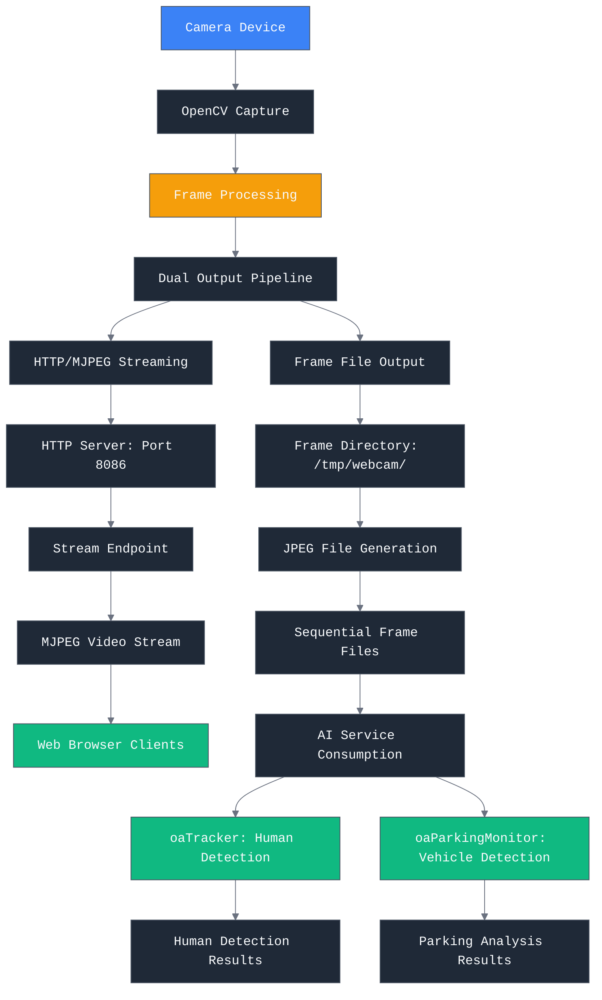

### Frame Processing Workflow

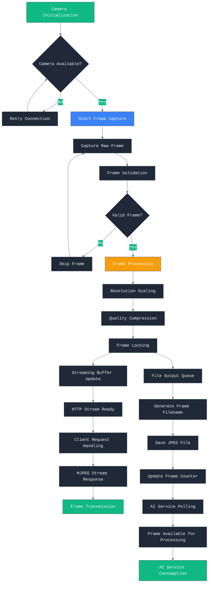

## HTTP API Structure and Streaming

### HTTP Server Architecture

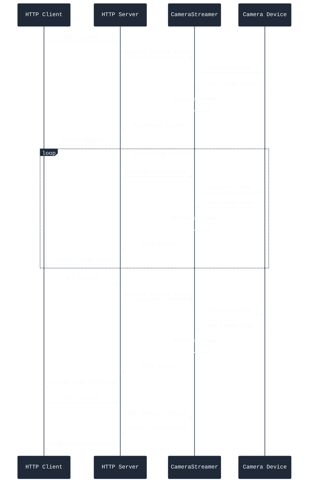

### API Endpoint Processing

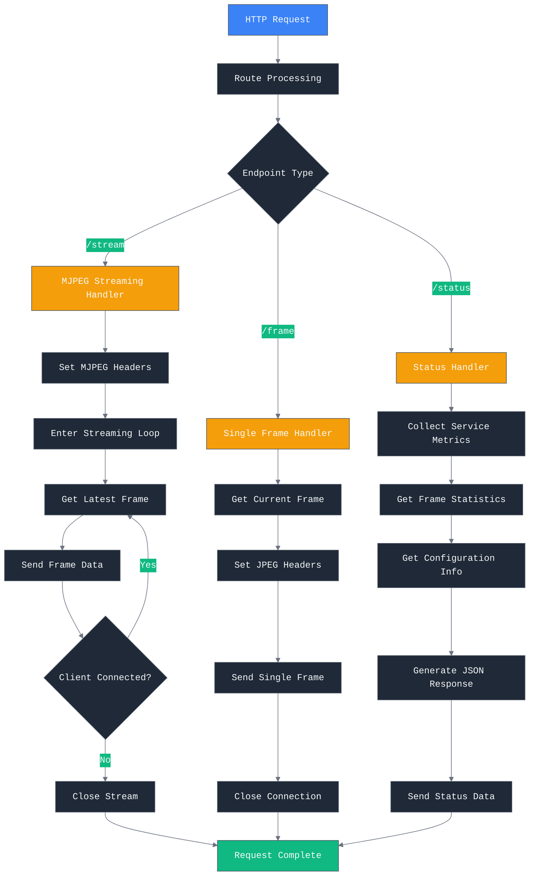

## AI Service Integration Patterns

### oaTracker Integration Workflow

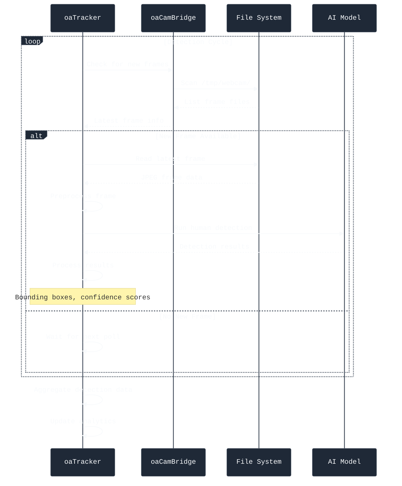

### oaParkingMonitor Integration Workflow

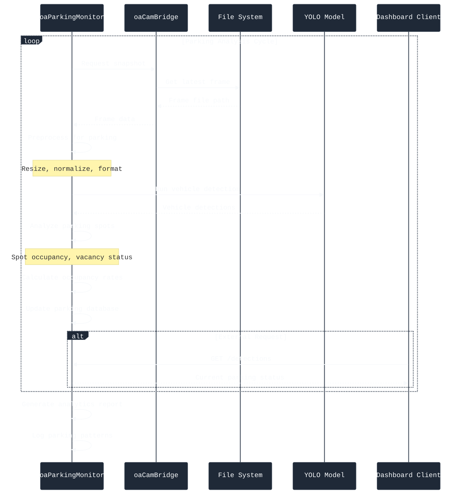

### Multi-Service Frame Distribution

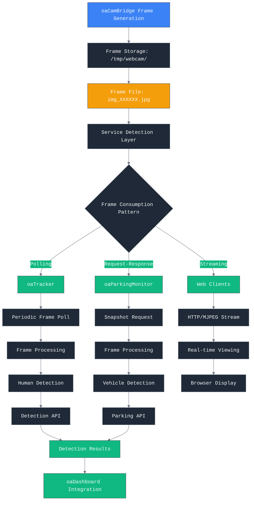

## Camera Permission Handling (macOS)

### macOS Camera Permission Flow

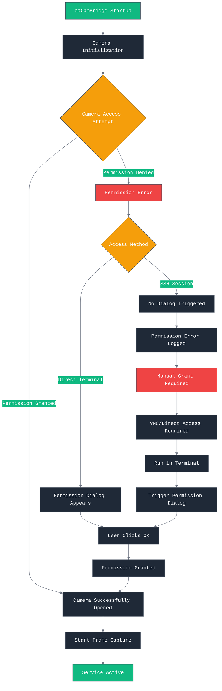

### Permission Troubleshooting Workflow

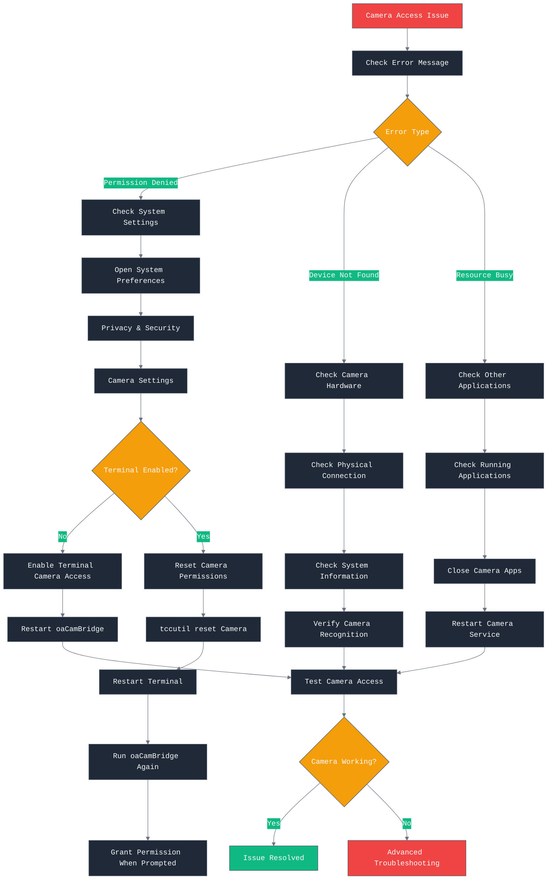

## Performance and Reliability Patterns

### Frame Management and Storage

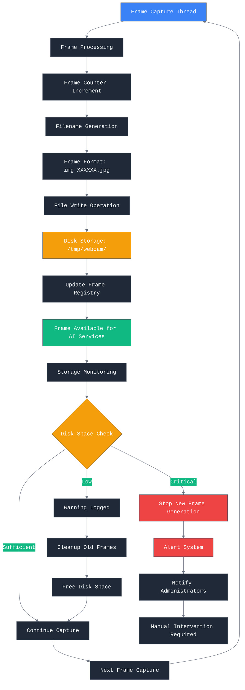

### Service Recovery and Error Handling

```mermaid
%%{init: {
  'theme': 'base',
  'themeVariables': {
    'primaryColor': '#1f2937',
    'primaryTextColor': '#f8fafc',
    'primaryBorderColor': '#4b5563',
    'lineColor': '#6b7280',
    'sectionBkgColor': '#374151',
    'altSectionBkgColor': '#1f2937',
    'gridColor': '#4b5563',
    'secondaryColor': '#10b981',
    'secondaryTextColor': '#f8fafc',
    'tertiaryColor': '#ef4444',
    'tertiaryTextColor': '#f8fafc',
    'background': '#111827',
    'fontFamily': 'monospace'
  }
}}%%
stateDiagram-v2
    [*] --> ServiceStarting

    state ServiceStarting {
        [*] --> InitializeCamera
        InitializeCamera --> StartHTTPServer
        StartHTTPServer --> StartFrameCapture
        StartFrameCapture --> ServiceActive
    }

    ServiceActive --> CameraError: Camera Failure
    ServiceActive --> HTTPServerError: HTTP Server Issue
    ServiceActive --> StorageError: Disk Space Issue

    state CameraError {
        [*] --> LogError
        LogError --> AttemptReconnect
        AttemptReconnect --> ReconnectSuccess
        ReconnectSuccess --> ServiceActive: Success
        ReconnectSuccess --> CameraFailure: Failure
        CameraFailure --> WaitForManualRecovery
    }

    state HTTPServerError {
        [*] --> RestartServer
        RestartServer <<choice>> --> ServerStarted{Server Started?}
        ServerStarted -->|Yes| ServiceActive
        ServerStarted -->|No| ServerFailure
        ServerFailure --> WaitForManualRecovery
    }

    state StorageError {
        [*] --> CheckDiskSpace
        CheckDiskSpace <<choice>> --> SpaceAvailable{Space Available?}
        SpaceAvailable -->|Yes| CleanupFrames
        SpaceAvailable -->|No| StorageFull
        CleanupFrames --> ServiceActive
        StorageFull --> WaitForManualRecovery
    }

    ServiceActive --> ServiceStopped: Manual Stop
    WaitForManualRecovery --> ServiceStopped: Manual Intervention
    ServiceStopped --> [*]
```

## Configuration and Deployment

### Service Configuration Management

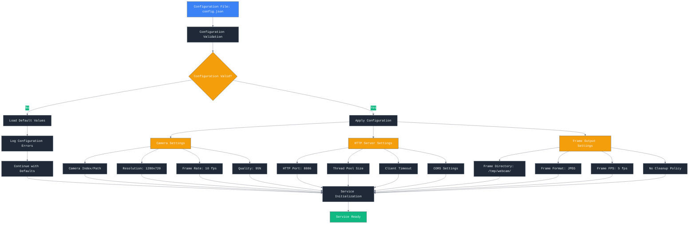

### LaunchAgent Service Deployment

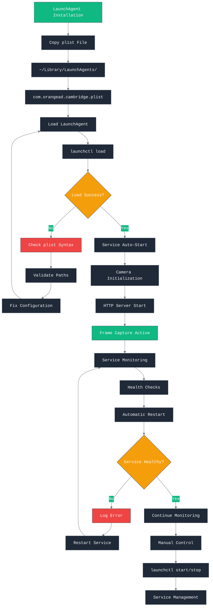

## Integration Testing and Validation

### End-to-End Testing Workflow

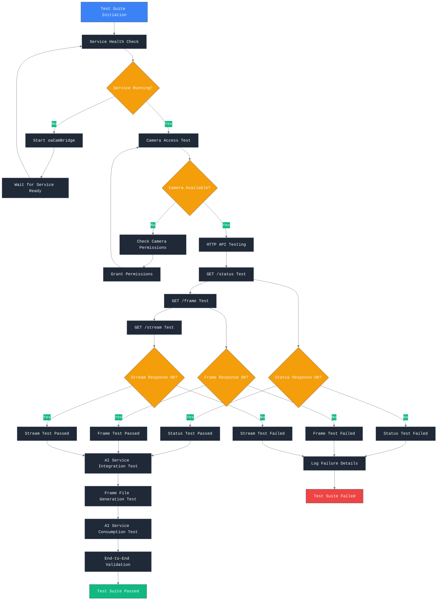

### AI Service Integration Testing

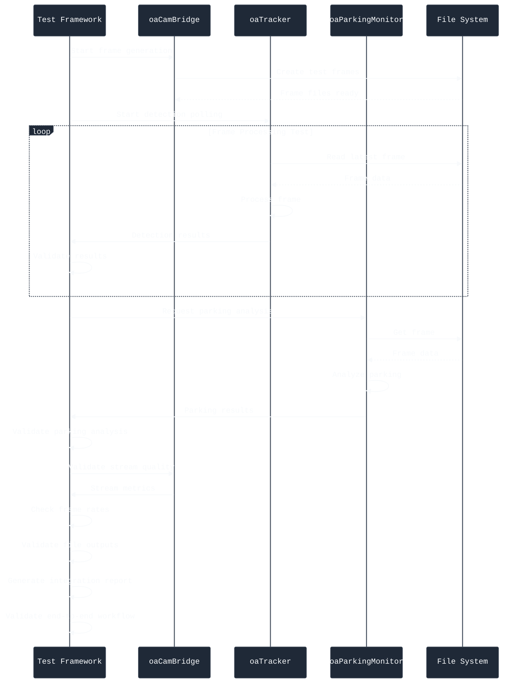

## Key Workflow Insights

### Architecture Strengths
- **Dual Output Pipeline**: Simultaneous streaming and file output
- **Service Isolation**: Independent AI service consumption
- **No Cleanup Policy**: Ensures frame availability for AI processing
- **Thread-Safe Operations**: Concurrent HTTP and frame processing

### Performance Characteristics
- **Frame Rate**: 10 fps capture, 5 fps file output
- **Resolution**: 1280x720 default, configurable
- **Latency**: < 100ms frame processing
- **Storage**: Sequential frame files, no automatic cleanup

### Integration Patterns
- **Polling Pattern**: oaTracker polls for new frames
- **Request-Response**: oaParkingMonitor requests snapshots
- **Streaming Pattern**: Web clients consume MJPEG streams
- **File-Based**: AI services read from filesystem

### Reliability Features
- **Error Recovery**: Automatic reconnection for camera issues
- **Permission Handling**: macOS camera permission management
- **Service Monitoring**: Health checks and automatic restart
- **Resource Management**: Disk space monitoring and alerts

This workflow documentation provides comprehensive coverage of oaCamBridge operations, integration patterns, and performance considerations for reliable camera streaming and AI service integration.